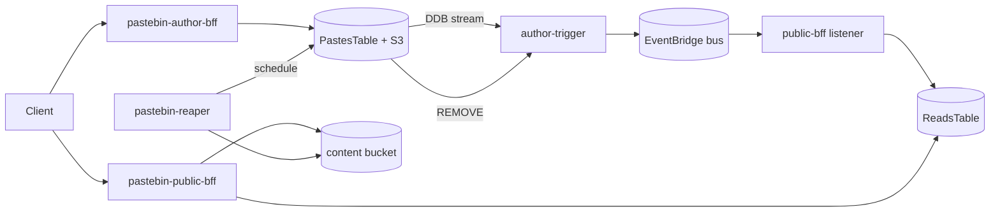

# pastebin-app

AWS serverless pastebin built with **Serverless Framework v4** and **Nx**. Event-sourced / CQRS architecture: four CloudFormation stacks share one EventBridge bus in **`ap-southeast-1`**.

Sibling to [`../url-shortener-app/`](../url-shortener-app/) — same conventions, template set, and bus-archive shape.

## Architecture

Three concerns, four deployable stacks plus a shared event hub:

| Concern | Stack | Role |
|---------|-------|------|
| Event bus | [`pastebin-event-hub/`](./pastebin-event-hub/) | Shared EventBridge bus + archive |
| Authoring | [`pastebin-author-bff/`](./pastebin-author-bff/) | JWT-protected create/list API; owns PastesTable + S3 content |
| Public read | [`pastebin-public-bff/`](./pastebin-public-bff/) | Anonymous read API; lean DDB view materialized from the bus |
| Expiry | [`pastebin-reaper/`](./pastebin-reaper/) | Scheduled sweep of expired pastes (GSI2 → S3 + DDB delete) |



**Key invariant:** the DDB stream is the sole event producer. Handlers never call `PutEvents` directly — `author-trigger` publishes `PasteCreated` / `PasteDeleted` to the bus. The reaper deletes rows and lets the same CDC path emit `PasteDeleted`.

## Prerequisites

- Node.js **20+**
- AWS credentials configured for deploys
- Serverless Framework v4 (via Nx targets)

## Getting started

```bash
npm install
npm run typecheck
```

## Deploy

Deploy in order — later stacks import CloudFormation outputs from earlier ones:

```bash
npm run package:event-hub && npm run deploy:event-hub   # bus first
npm run deploy:author-bff
npm run deploy:public-bff
npm run deploy:reaper
```

Default stage: **`dev`** · Region: **`ap-southeast-1`**

| Stack | CloudFormation name (dev) |
|-------|---------------------------|
| Event hub | `pastebin-event-hub-dev` |
| Author BFF | `pastebin-author-bff-dev` |
| Public BFF | `pastebin-public-bff-dev` |
| Reaper | `pastebin-reaper-dev` |

## API surface

**Author BFF** (Cognito JWT on `/pastes` and `/me/pastes`):

| Method | Path | Auth |
|--------|------|------|
| `POST` | `/pastes` | JWT |
| `GET` | `/me/pastes` | JWT |
| `GET` | `/health` | public |

**Public BFF** (anonymous):

| Method | Path | Purpose |
|--------|------|---------|
| `GET` | `/p/{pasteId}` | Paste body (S3-backed) |
| `GET` | `/p/{pasteId}/meta` | Metadata only |
| `GET` | `/health` | Health check |

See each stack's README for request/response details and cross-stack wiring.

## Development

```bash
npm run typecheck          # all stacks
npm run show:projects      # list Nx projects
npm run graph              # dependency graph
npm run package:author-bff # synth a single stack
```

Prefer Nx/npm scripts over invoking `serverless` directly when a target exists.

## Documentation

| Doc | Contents |
|-----|----------|
| [`design-research.md`](./design-research.md) | Architecture deep dive + resolved design decisions |
| [`system_design__architecting_a_pastebin_service.md`](./system_design__architecting_a_pastebin_service.md) | Textbook brief this repo implements |
| [`AGENTS.md`](./AGENTS.md) | Conventions for AI agents working in this repo |
| [`../url-shortener-app/design-research.md`](../url-shortener-app/design-research.md) | Sibling repo architecture (format reference) |
